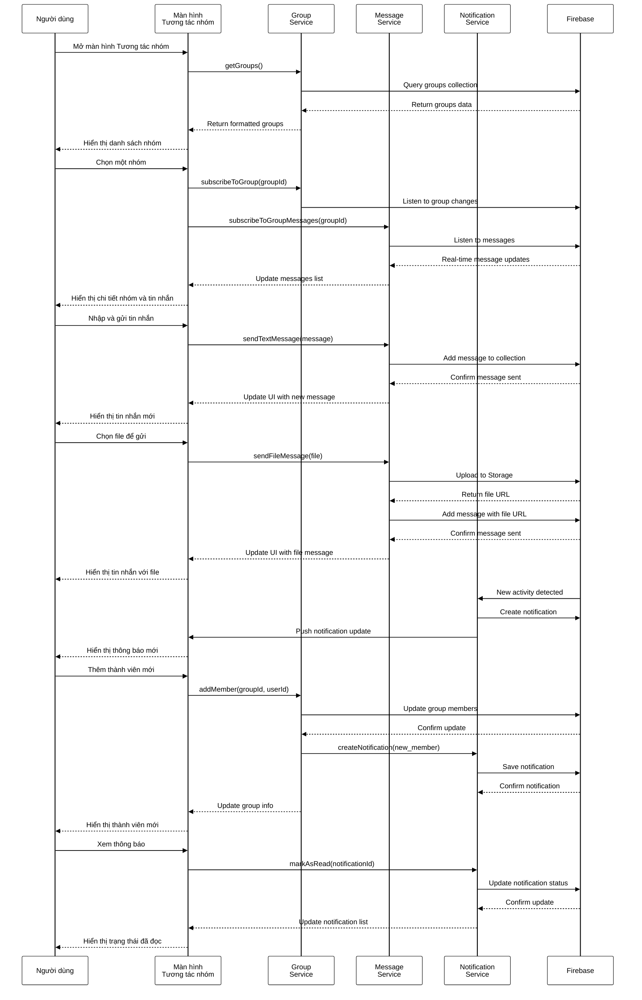

```mermaid
%%{init: {
    'theme': 'base',
    'themeVariables': {
        'primaryColor': '#ffffff',
        'primaryTextColor': '#000000',
        'primaryBorderColor': '#000000',
        'lineColor': '#000000',
        'secondaryColor': '#ffffff',
        'tertiaryColor': '#ffffff'
    }
}}%%
sequenceDiagram
    participant U as Người dùng
    participant UI as Màn hình<br/>Tương tác nhóm
    participant GS as Group<br/>Service
    participant MS as Message<br/>Service
    participant NS as Notification<br/>Service
    participant FB as Firebase
    
    %% Luồng xem danh sách nhóm
    U->>UI: Mở màn hình Tương tác nhóm
    UI->>GS: getGroups()
    GS->>FB: Query groups collection
    FB-->>GS: Return groups data
    GS-->>UI: Return formatted groups
    UI-->>U: Hiển thị danh sách nhóm

    %% Luồng vào chi tiết nhóm
    U->>UI: Chọn một nhóm
    UI->>GS: subscribeToGroup(groupId)
    GS->>FB: Listen to group changes
    UI->>MS: subscribeToGroupMessages(groupId)
    MS->>FB: Listen to messages
    FB-->>MS: Real-time message updates
    MS-->>UI: Update messages list
    UI-->>U: Hiển thị chi tiết nhóm và tin nhắn

    %% Luồng gửi tin nhắn
    U->>UI: Nhập và gửi tin nhắn
    UI->>MS: sendTextMessage(message)
    MS->>FB: Add message to collection
    FB-->>MS: Confirm message sent
    MS-->>UI: Update UI with new message
    UI-->>U: Hiển thị tin nhắn mới

    %% Luồng upload file
    U->>UI: Chọn file để gửi
    UI->>MS: sendFileMessage(file)
    MS->>FB: Upload to Storage
    FB-->>MS: Return file URL
    MS->>FB: Add message with file URL
    FB-->>MS: Confirm message sent
    MS-->>UI: Update UI with file message
    UI-->>U: Hiển thị tin nhắn với file

    %% Luồng thông báo
    FB->>NS: New activity detected
    NS->>FB: Create notification
    NS->>UI: Push notification update
    UI-->>U: Hiển thị thông báo mới

    %% Luồng quản lý thành viên
    U->>UI: Thêm thành viên mới
    UI->>GS: addMember(groupId, userId)
    GS->>FB: Update group members
    FB-->>GS: Confirm update
    GS->>NS: createNotification(new_member)
    NS->>FB: Save notification
    FB-->>NS: Confirm notification
    GS-->>UI: Update group info
    UI-->>U: Hiển thị thành viên mới

    %% Luồng đọc thông báo
    U->>UI: Xem thông báo
    UI->>NS: markAsRead(notificationId)
    NS->>FB: Update notification status
    FB-->>NS: Confirm update
    NS-->>UI: Update notification list
    UI-->>U: Hiển thị trạng thái đã đọc
``` 